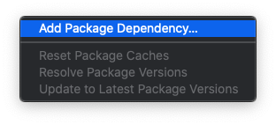
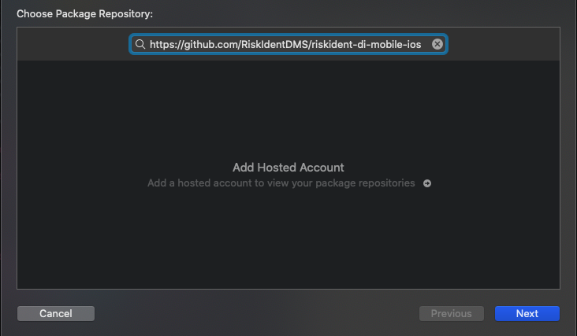
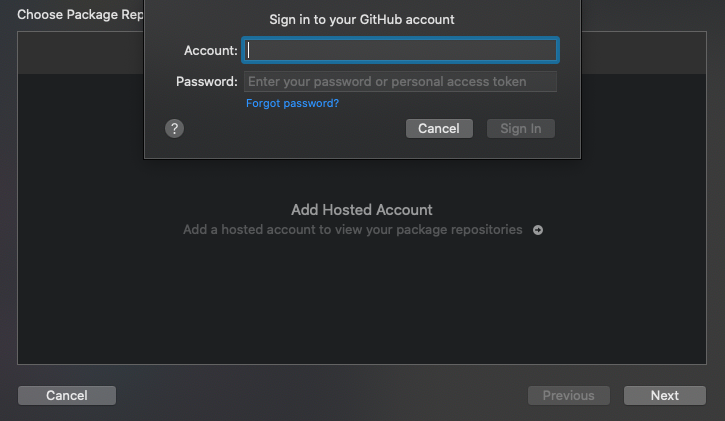
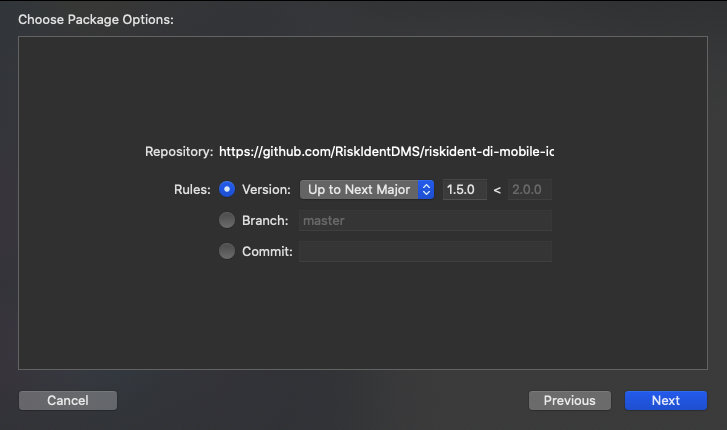
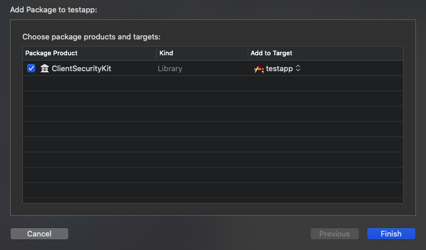

# Dependency via Swift Package Manager (Xcode)
1. Open your project
1. Click on File -> Swift Packages -> Add Package Dependency 
1. Use https://github.com/RiskIdentDMS/riskident-di-mobile-ios 
1. Enter credentials of the github account whitelisted with Risk.Ident
1. Select desired version constraint
1. Check that library is included
